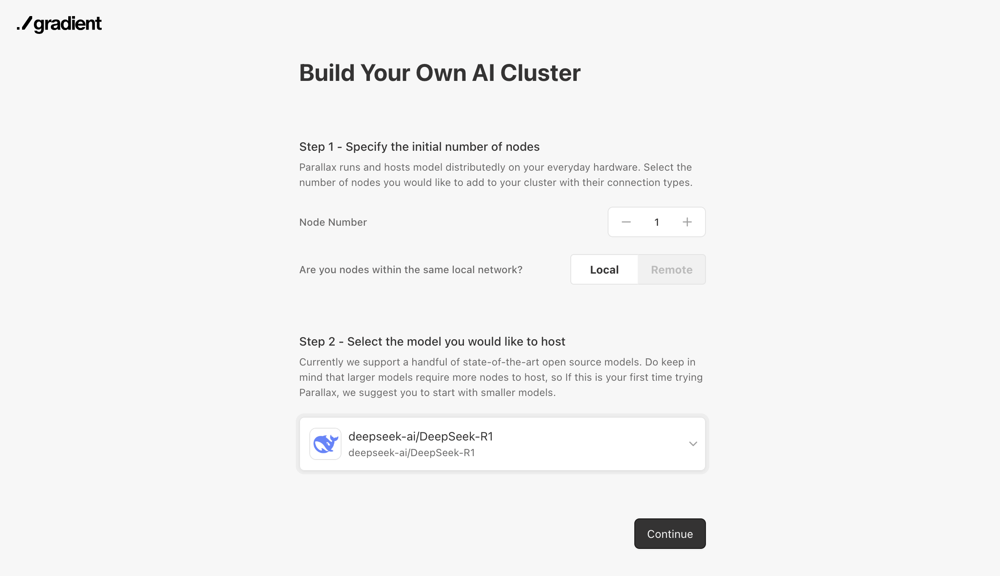
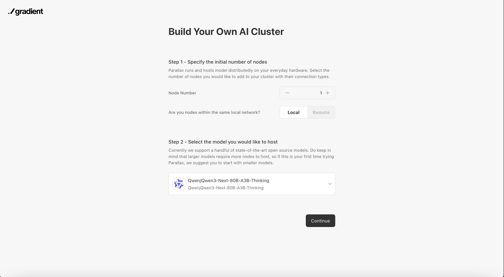
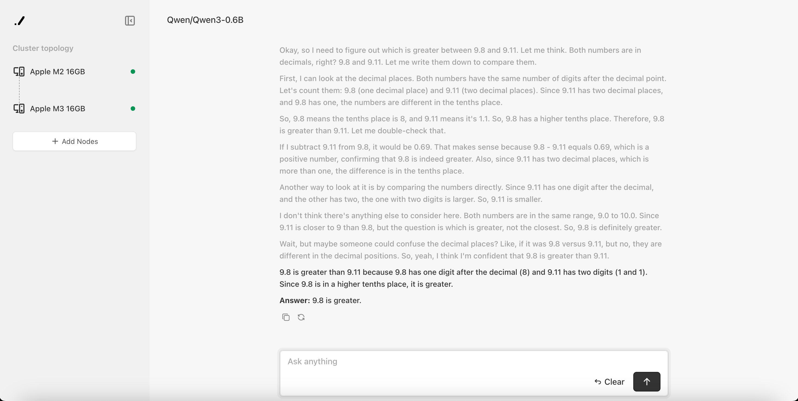

<div align="center">
  

  <h1>Parallax</h1>

  <p><strong>Distributed LLM serving across Macs, Windows PCs, and GPU machines.</strong></p>
  <p>
    Build an OpenAI-compatible inference cluster with mixed-device setup,
    automatic node discovery, pipeline-parallel sharding, and a browser setup flow.
  </p>

  [](https://github.com/GradientHQ/parallax/releases)
  [](./LICENSE)
  [](./pyproject.toml)
  [](https://github.com/GradientHQ/parallax/issues)

  <p>
    <a href="#quickstart">Quickstart</a> ·
    <a href="#supported-models">Models</a> ·
    <a href="#dashboard">Dashboard</a> ·
    <a href="#runtime-stack">Runtime</a> ·
    <a href="#features">Features</a> ·
    <a href="#architecture">Architecture</a> ·
    <a href="#news">News</a> ·
    <a href="#docs">Docs</a>
  </p>

  <p>
    <a href="https://gradient.network">Gradient</a> ·
    <a href="https://gradient.network/blog/parallax-the-sovereign-ai-os">Blog</a> ·
    <a href="https://discord.gg/parallaxai">Discord</a> ·
    <a href="https://x.com/tryParallax">X</a> ·
    <a href="https://arxiv.org/pdf/2509.26182v1">Paper</a>
  </p>

  <a href="https://www.producthunt.com/products/parallax-by-gradient?embed=true&utm_source=badge-top-post-badge&utm_medium=badge&utm_source=badge-parallax&#0045;by&#0045;gradient" target="_blank"></a>

  <p><strong>Works with</strong></p>
  <p>
    
    &nbsp;&nbsp;&nbsp;
    
    &nbsp;&nbsp;&nbsp;
    
    &nbsp;&nbsp;&nbsp;
    
    &nbsp;&nbsp;&nbsp;
    
    &nbsp;&nbsp;&nbsp;
    
    &nbsp;&nbsp;&nbsp;
    
  </p>
</div>

## News

- [2026/6] 🚀 Parallax now supports ModelScope downloads! Prefix any command with `USE_MODELSCOPE=1`.
- [2026/5] 🍎 Added Apple M5 series chip support for Mac workers.
- [2026/2] 🦞 Parallax now supports OpenClaw integration! See [Docs](./docs/user_guide/work_with_openclaw.md)
- [2025/10] 🔥 Parallax won #1 Product of The Day on Product Hunt!
- [2025/10] 🔥 Parallax version 0.0.1 has been released!

## Why Parallax

Parallax is a decentralized inference engine from [Gradient](https://gradient.network). It turns multiple local or remote machines into one serving cluster, so you can host larger open models and route requests across heterogeneous hardware without putting every weight on a single box.

Use Parallax when you want to:

- Run one model across multiple worker nodes with pipeline-parallel layer sharding.
- Serve an OpenAI-compatible API (`/v1/models`, `/v1/chat/completions`) from your own machines. Other OpenAI endpoints may not be available.
- Mix Apple Silicon Macs, Windows PCs, and Linux GPU hosts in the same cluster.
- Use GPU backends (SGLang, vLLM) and the Mac MLX backend behind one API.
- Bring nodes together on a LAN or through Lattica relay servers for remote clusters.
- Manage setup, model selection, node joining, and chat from a browser UI.

## Quickstart

This path starts a scheduler with the web UI, joins worker nodes, and sends a request through the OpenAI-compatible API.

### 1. Choose an install path

Different devices use different install paths. After installation, the cluster workflow is the same: start a scheduler, join workers, then call the OpenAI-compatible API.

| Device | Recommended path | Commands |
|:--|:--|:--|
| Apple Silicon macOS | Source install with Mac extras | `git clone https://github.com/GradientHQ/parallax.git`<br>`cd parallax`<br>`./install.sh --extras mac`<br>`source .venv/bin/activate` |
| Linux / WSL GPU host | Source install with GPU extras | `git clone https://github.com/GradientHQ/parallax.git`<br>`cd parallax`<br>`./install.sh --extras gpu`<br>`source .venv/bin/activate` |
| Windows PC | Windows app | Download [Parallax_Win_Setup.exe](https://github.com/GradientHQ/parallax_win_cli/releases/latest/download/Parallax_Win_Setup.exe), open Windows Terminal as administrator, then run `parallax install`. |
| Linux GPU container | Docker | `docker run -it --gpus all --network host gradientservice/parallax:latest bash` (use `:latest-spark` for DGX Spark / GB10). |

For macOS and Linux, the default source install also auto-selects the right extras:

```sh
git clone https://github.com/GradientHQ/parallax.git
cd parallax
./install.sh
source .venv/bin/activate
```

The installer creates `.venv`, installs Parallax, selects the default extras for your platform, and builds the `vllm-rs` frontend binary into `.venv/bin`.

### 2. Start the scheduler

Run this on the machine that should host the setup UI and API:

```sh
parallax run
```

Open [http://localhost:3001](http://localhost:3001), choose a model and node count, then continue to the join screen.

To expose the scheduler to other machines on your network:

```sh
parallax run --host 0.0.0.0
```

For nodes outside the same LAN, enable relay mode:

```sh
parallax run -r
```

### 3. Join workers

Run the generated join command on each worker node. For a local network cluster, the command is usually:

```sh
parallax join
```

For remote or public-network nodes, use the scheduler address shown in the UI or logs:

```sh
parallax join -s <scheduler-address>
```

When all nodes are connected, Parallax routes you to the chat interface.

### 4. Call the API

```sh
curl http://localhost:3001/v1/chat/completions \
  -H "Content-Type: application/json" \
  -d '{
    "model": "<model>",
    "messages": [{"role": "user", "content": "hello"}],
    "max_tokens": 256,
    "stream": true
  }'
```

Use the model ID you chose in the setup UI, or fetch the active model from `GET /v1/models`.

### Headless quickstart

If you do not need the setup UI, start the scheduler with a model and expected worker count:

```sh
# terminal 1
parallax run -m Qwen/Qwen3-0.6B -n 2

# terminal 2 and each worker node
parallax join
```

To run a single standalone server without the dashboard or scheduler:

```sh
parallax serve --model-path Qwen/Qwen3-0.6B
```

### Downloading from ModelScope

Parallax downloads model weights from Hugging Face by default. To pull from ModelScope instead, set `USE_MODELSCOPE=1` on any Parallax process that resolves or loads the model. Use a model ID that exists on ModelScope.

```sh
USE_MODELSCOPE=1 parallax run -m Qwen/Qwen3-0.6B -n 2
USE_MODELSCOPE=1 parallax join -s <scheduler-address>
USE_MODELSCOPE=1 parallax serve --model-path Qwen/Qwen3-0.6B
```

## Supported Models

Parallax supports a growing set of open model families. On Apple Silicon, many public Hugging Face IDs are mapped to MLX-optimized variants automatically. Recent model work expanded Qwen3.6/Qwen3.5 architecture support, GLM-5.1, MiniMax-M2.7, Step-3.5-Flash, DeepSeek-V3.2, Kimi-K2 Thinking, and gpt-oss safeguard coverage.

| Family | Example model IDs | Notes |
|:--|:--|:--|
| Qwen | `Qwen/Qwen3-0.6B`, `Qwen/Qwen3-32B`, `Qwen/Qwen3-Next-80B-A3B-Instruct`, `Qwen/Qwen3.6-27B`, `Qwen/Qwen3-235B-A22B-GPTQ-Int4` | Dense, MoE, Next, Qwen3.6/Qwen3.5 architecture, thinking, FP8, GPTQ, and MLX variants. |
| DeepSeek | `deepseek-ai/DeepSeek-V3.2`, `deepseek-ai/DeepSeek-R1`, `deepseek-ai/DeepSeek-V3.1` | V3.2, R1, and earlier large reasoning/MoE families. |
| Kimi-K2 | `moonshotai/Kimi-K2-Instruct`, `moonshotai/Kimi-K2-Instruct-0905`, `moonshotai/Kimi-K2-Thinking` | Instruct and thinking model variants with MLX mappings. |
| MiniMax | `MiniMaxAI/MiniMax-M2`, `MiniMaxAI/MiniMax-M2.1`, `MiniMaxAI/MiniMax-M2.7` | Sparse MoE coding and agent models, including M2.7. |
| GLM / Z.ai | `zai-org/GLM-4.7`, `zai-org/GLM-4.7-Flash`, `zai-org/GLM-5.1` | GLM 4.x, Flash, FP8, and 5.1 families with MLX mappings. |
| gpt-oss | `openai/gpt-oss-20b`, `openai/gpt-oss-120b`, `openai/gpt-oss-safeguard-20b`, `openai/gpt-oss-safeguard-120b` | Open-weight GPT and safeguard models. |
| Llama | `nvidia/Llama-3.1-8B-Instruct-FP8`, `nvidia/Llama-3.3-70B-Instruct-FP8` | FP8 Llama serving paths. |
| StepFun | `stepfun-ai/Step-3.5-Flash` | Additional large-model serving target. |

See [`src/backend/server/static_config.py`](./src/backend/server/static_config.py) for the current model map.

## Dashboard

Parallax ships with a browser setup and chat flow at `http://localhost:3001`, so the first cluster can be launched without hand-writing node configuration.

| Setup | Join workers | Chat |
|:--:|:--:|:--:|
|  |  |  |

## Runtime Stack

Current pins from `pyproject.toml` and the latest GitHub `main` install script:

| Component | Version | Used for |
|:--|:--|:--|
| SGLang | `sglang[all]==0.5.12` | Linux/WSL GPU backend. |
| vLLM | `vllm==0.14.0` | Optional GPU backend and vLLM compatibility path. |
| vLLM Rust frontend | `v0.22.0` on current GitHub `main` | Rust frontend binary built by `./install.sh`. |
| MLX-LM | `mlx-lm==0.31.3` | Apple Silicon model execution and model utilities. |
| MLX | `mlx==0.31.2` / `mlx[cpu]==0.31.2` | Mac backend and CPU-side MLX compatibility. |
| Lattica | `lattica==1.0.21` | P2P discovery, messaging, and relay-assisted remote clusters. |
| Transformers | `>=4.57.1` | Tokenizer/model config compatibility. |

## Features

- **Automatic cluster setup**: launch a scheduler, copy the join command, and let nodes discover the cluster through Lattica.
- **Pipeline-parallel model sharding**: split model layers across workers so one deployment can use memory and compute from multiple devices.
- **Dynamic scheduling and routing**: route requests through available pipelines based on live node state.
- **Multiple execution backends**: SGLang and vLLM for GPU hosts, MLX-LM for Apple Silicon Macs.
- **Paged KV cache and continuous batching on Mac**: improve local serving throughput and memory behavior for supported MLX paths. Recent main also adds chunked prefill (MLX and SGLang), linear prefix cache, and paged attention v2 for long context.
- **Browser UI**: configure the model, watch nodes join, inspect cluster status, and chat from the built-in frontend.
- **OpenAI-compatible API**: point existing clients at `http://localhost:3001/v1`. Current compatibility focuses on `/v1/models` and `/v1/chat/completions`; other OpenAI endpoints may not be available.
- **Standalone server**: run a single-host setup with `parallax serve --model-path <model>` when you do not need the scheduler/dashboard.
- **ModelScope downloads**: prefix any Parallax command with `USE_MODELSCOPE=1` to pull weights from ModelScope instead of Hugging Face.
- **Remote cluster support**: use public relay servers when nodes are not on the same LAN.
- **OpenClaw integration**: connect Parallax as a local model provider for OpenClaw.

## Architecture

Parallax is split into a scheduler/API process and worker node processes:

- The scheduler runs the setup UI and OpenAI-compatible API on port `3001`.
- Workers run model shards and local HTTP servers on port `3000`.
- Optional chat clients can run with `parallax chat` and serve a chat UI on port `3002`.
- Lattica handles P2P communication, discovery, and relay-assisted remote connections.
- The scheduler computes layer allocation, tracks node state, and forwards requests through the selected pipeline.

Backend stack:

- [Lattica](https://github.com/GradientHQ/lattica) for P2P networking.
- [SGLang](https://github.com/sgl-project/sglang) and [vLLM](https://github.com/vllm-project/vllm) for GPU execution.
- [MLX-LM](https://github.com/ml-explore/mlx-lm) for Apple Silicon execution.

## Docs

- [Installation Guide](./docs/user_guide/install.md)
- [Getting Started](./docs/user_guide/quick_start.md)
- [Working with OpenClaw](./docs/user_guide/work_with_openclaw.md)
- [Contributing Guide](./docs/CONTRIBUTING.md)

## Development

```sh
./install.sh --extras mac,dev
# or
./install.sh --extras gpu,dev

pre-commit run --all-files
pytest
```

For low-level backend debugging, you can start a single node directly:

```sh
python src/parallax/launch.py --model-path Qwen/Qwen3-0.6B --log-level DEBUG
```

## Troubleshooting

- If workers cannot see the scheduler on a LAN, start the scheduler with `--host 0.0.0.0` and confirm firewall rules allow scheduler port `3001`, worker port `3000`, and the selected TCP/UDP Lattica ports.
- On macOS, allow Terminal, iTerm2, VS Code, Cursor, or your chosen shell app to access the Local Network in System Settings.
- On WSL, use mirrored networking mode so other machines on the LAN can reach the scheduler.
- For remote clusters, use the generated `parallax join -s <scheduler-address>` command and relay mode from the setup flow.

## Contributing

Contributions are welcome. Please read the [Contributing Guide](./docs/CONTRIBUTING.md), run the relevant tests, and open a pull request with a clear description of the change.

## License

Parallax is licensed under the [Apache 2.0 License](./LICENSE).
