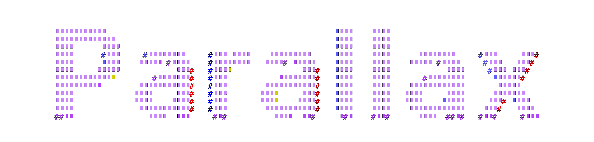
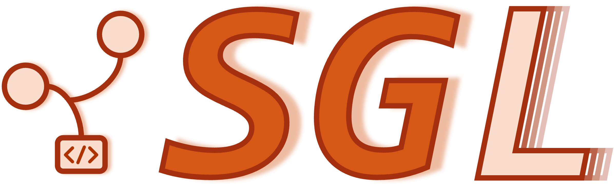
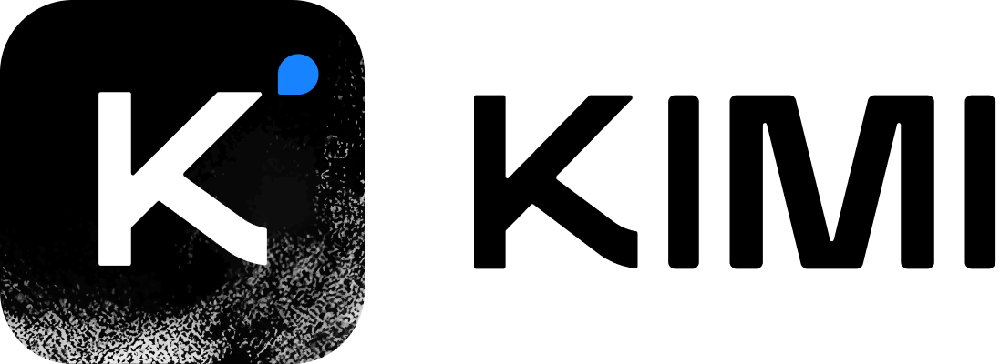

<div align="center">
  <p align="center">
    
    <div align="center">
      <p style="font-size: 1.3em; font-weight: 600; margin-bottom: 10px;">Trusted by Partners</p>
      
      
      
      
      
      
      
    </div>
  </p>

[](https://github.com/GradientHQ/parallax/tree/main/LICENSE)
[](https://github.com/GradientHQ/parallax/issues)
[](https://github.com/GradientHQ/parallax/issues)

<a href="https://www.producthunt.com/products/parallax-by-gradient?embed=true&utm_source=badge-top-post-badge&utm_medium=badge&utm_source=badge-parallax&#0045;by&#0045;gradient" target="_blank"></a>

</div>

[**Gradient**](https://gradient.network) |
[**Blog**](https://gradient.network/blog/parallax-the-sovereign-ai-os) |
[**X/Twitter (Gradient)**](https://x.com/Gradient_HQ) |
[**X/Twitter (Parallax)**](https://x.com/tryParallax) |
[**Discord**](https://discord.gg/parallaxai) |
[**Arxiv**](https://arxiv.org/pdf/2509.26182v1)

## News
- [2026/02] 🦞 Parallax now supports OpenClaw integration! See [Docs](./docs/user_guide/work_with_openclaw.md)
- [2025/10] 🔥 Parallax won #1 Product of The Day on Product Hunt!
- [2025/10] 🔥 Parallax version 0.0.1 has been released!

## About
A fully decentralized inference engine developed by [Gradient](https://gradient.network). Parallax lets you build your own AI cluster for model inference onto a set of distributed nodes despite their varying configuration and physical location. Its core features include:

- **Host local LLM on personal devices**
- **Cross-platform support**
- **Pipeline parallel model sharding**
- **Paged KV cache management & continuous batching for Mac**
- **Dynamic request scheduling and routing for high performance**

The backend architecture:

* P2P communication powered by [Lattica](https://github.com/GradientHQ/lattica)
* GPU backend powered by [SGLang](https://github.com/sgl-project/sglang) and [vLLM](https://github.com/vllm-project/vllm)
* Mac backend powered by [MLX LM](https://github.com/ml-explore/mlx-lm)

## User Guide

- [Installation](./docs/user_guide/install.md)
- [Getting Started](./docs/user_guide/quick_start.md)
- [Working with OpenClaw 🦞](./docs/user_guide/work_with_openclaw.md)

## Quick Install

```sh
git clone https://github.com/GradientHQ/parallax.git
cd parallax
./install.sh
source .venv/bin/activate
parallax serve -m Qwen/Qwen3.5-0.8B
```

## Contributing

We warmly welcome contributions of all kinds! For guidelines on how to get involved, please refer to our [Contributing Guide](./docs/CONTRIBUTING.md).

## Supported Models

|              | Provider     | HuggingFace Collection  |  Blog  | Description |
|:-------------|:-------------|:----------------------------:|:----------------------------:|:----------------------------|
|DeepSeek      | Deepseek     | [DeepSeek-V3.2](https://huggingface.co/deepseek-ai/DeepSeek-V3.2)<br>[DeepSeek-R1](https://huggingface.co/collections/deepseek-ai/deepseek-r1) <br>| [DeepSeek-V3.2 Release](https://api-docs.deepseek.com/news/news251201) | DeepSeek-V3.2 is built for stronger reasoning and agent workflows, adding thinking-aware tool use while keeping both thinking and non-thinking tool-use modes available. |
|MiniMax       | MiniMax AI  | [MiniMax-M3](https://huggingface.co/MiniMaxAI/MiniMax-M3)<br>[MiniMax-M2.7](https://huggingface.co/MiniMaxAI/MiniMax-M2.7) | [MiniMax M3: Frontier Coding, 1M Context, Native Multimodality](https://www.minimax.io/blog/minimax-m3) | MiniMax-M3 is a sparse-attention model for coding, agentic work, long-context tasks, and multimodal input, with MiniMax-M2.7 kept as a supported sibling model. |
|GLM           | Z AI | [GLM-5.2](https://huggingface.co/zai-org/GLM-5.2)<br>[GLM-5.1](https://huggingface.co/zai-org/GLM-5.1)<br>[GLM-4.7](https://huggingface.co/zai-org/GLM-4.7) | [GLM-5.2: Built for Long-Horizon Tasks](https://z.ai/blog/glm-5.2) | GLM-5.2 is Z AI's latest flagship model for long-horizon coding agents, large-scale implementation, automated research, and performance optimization. |
|Kimi-K2       | Moonshot AI  | [Kimi-K2-Thinking](https://huggingface.co/moonshotai/Kimi-K2-Thinking)<br>[Kimi-K2-Instruct-0905](https://huggingface.co/moonshotai/Kimi-K2-Instruct-0905) | [Kimi K2 Thinking](https://moonshotai.github.io/Kimi-K2/thinking.html) | Kimi-K2-Thinking is the reasoning-focused Kimi-K2 variant for long-horizon agentic workflows, multi-step reasoning, and tool-heavy tasks. |
|Qwen          | Qwen         | [Qwen3.6-35B-A3B](https://huggingface.co/Qwen/Qwen3.6-35B-A3B) | [Qwen3.6-35B-A3B: Agentic Coding Power, Now Open to All](https://qwen.ai/blog?id=qwen3.6-35b-a3b) | Qwen3.6-35B-A3B is an open-weight MoE model focused on stable, practical coding and agentic workflows, with Qwen3-Next and larger Qwen3 MoE variants also represented. |
|gpt-oss       | OpenAI       | [gpt-oss-120b](https://huggingface.co/openai/gpt-oss-120b)<br>[gpt-oss-safeguard-120b](https://huggingface.co/openai/gpt-oss-safeguard-120b) | [Introducing gpt-oss-safeguard](https://openai.com/index/introducing-gpt-oss-safeguard/) | gpt-oss-120b is OpenAI's open-weight GPT model; gpt-oss-safeguard-120b adds policy-driven reasoning classification for flexible moderation and safety workflows. |
|Step          | StepFun      | [Step-3.5-Flash](https://huggingface.co/stepfun-ai/Step-3.5-Flash) | [Step 3.5 Flash](https://static.stepfun.com/blog/step-3.5-flash/) | Step-3.5-Flash is a sparse MoE foundation model for efficient reasoning and agentic workflows, activating a small subset of its total parameters per token. |
